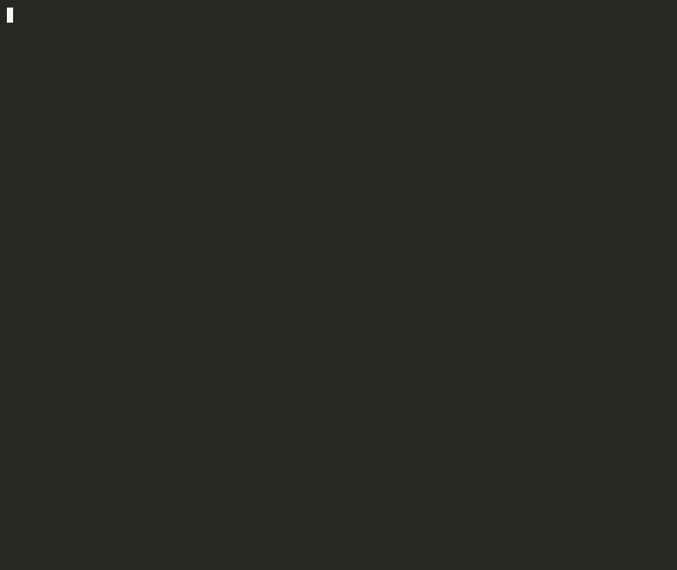
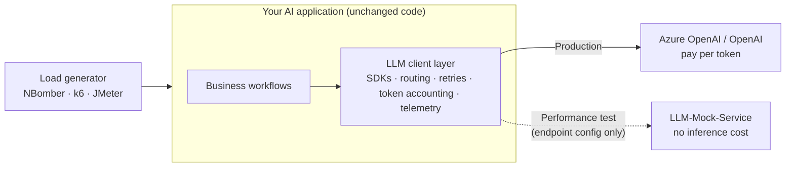
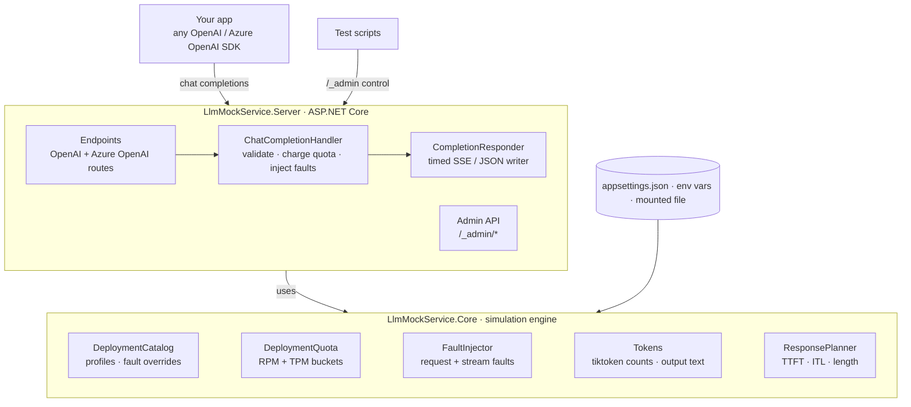
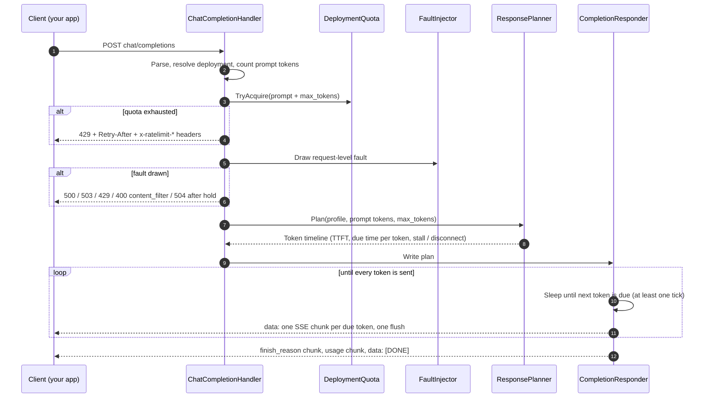

# LLM-Mock-Service

[](https://github.com/Phani-Dharmapuri/LLM-Mock-Service/actions/workflows/ci.yml)
[](LICENSE)

A wire-compatible mock of the **OpenAI** and **Azure OpenAI** chat completions APIs for **performance testing** AI applications without paying for inference.

Point your application's LLM endpoint at the mock and change nothing else. Your SDKs, retry policies, circuit breakers, routing/fallback logic, token accounting and telemetry all run exactly as they do in production. Only the model is simulated, with **realistic, calibrated timing**.

> Status: **v0.1**. Chat completions (streaming and non-streaming), latency profiles, RPM/TPM quotas with real 429s, and fault injection. See [Roadmap](#roadmap).



<sub>Real recording, no edits: tokens stream at the profile's TTFT and inter-token latency, a 3 RPM quota returns a 429 with `Retry-After`, and a regional outage is switched on and off through the admin API. Script: [`demo/demo.py`](demo/demo.py).</sub>

**Contents:** [Where it fits](#where-it-fits) · [Plug and play in 5 steps](#plug-and-play-in-5-steps) · [Architecture](#architecture) · [Project structure](#project-structure) · [Endpoints](#endpoints) · [Configuration](#configuration) · [Capacity and accuracy](#capacity-and-accuracy) · [Building and testing](#building-and-testing)

## Where it fits



The mock replaces only the box on the far right. Everything you own is still exercised under load.

### Why not just stub it?

A stub that returns canned JSON instantly makes performance tests meaningless. A realistic LLM dependency has:

| Behaviour | What it exercises in your app | v0.1 |
|---|---|---|
| Time-to-first-token that grows with prompt size | TTFT metrics, user-perceived latency, timeouts | ✅ |
| Per-token streaming over SSE | Stream parsing, back-pressure, connection pooling | ✅ |
| Long-tailed latency (p99 ≫ p50) | Tail latency, timeout tuning | ✅ log-normal |
| Per-deployment RPM/TPM quotas | 429 handling, `Retry-After`, regional fallback | ✅ token buckets |
| Accurate `usage` token counts | Cost/billing tracking, context-window logic | ✅ real tiktoken |
| Outages, 5xx, timeouts, dropped streams | Retries, circuit breakers | ✅ |

## Plug and play in 5 steps

### 1. Start the mock

Pick one:

```bash
# Docker (published image)
docker run --rm -p 8080:8080 ghcr.io/phani-dharmapuri/llm-mock-service:latest
```

```bash
# Docker Compose (builds from this repo)
docker compose up --build
```

```bash
# From source (.NET 10 SDK)
dotnet run --project src/LlmMockService.Server --urls http://localhost:8080
```

Check it is up:

```bash
curl http://localhost:8080/healthz
curl -N http://localhost:8080/v1/chat/completions -H 'content-type: application/json' \
  -d '{"model":"gpt-4o-mini","stream":true,"stream_options":{"include_usage":true},"messages":[{"role":"user","content":"Hello"}]}'
```

### 2. Mirror your deployments

Name the mock's deployments **exactly** as your app calls them: the Azure OpenAI deployment name in the URL, or the OpenAI `model` field. Give each one the quota it has in production, so throttling and fallback behave realistically. Create a file such as `my-profiles.json`:

```json
{
  "LlmMock": {
    "Profiles": {
      "my-gpt-4o": {
        "Encoding": "o200k_base",
        "TimeToFirstTokenMs":  { "Median": 520, "P99": 2100 },
        "PrefillMsPer1kInputTokens": 25,
        "InterTokenLatencyMs": { "Median": 19, "P99": 48 },
        "OutputTokens":        { "Median": 310, "P99": 1200 }
      }
    },
    "Deployments": {
      "chat-eastus":    { "Profile": "my-gpt-4o", "RequestsPerMinute": 300, "TokensPerMinute": 50000 },
      "chat-westeurope":{ "Profile": "my-gpt-4o", "RequestsPerMinute": 300, "TokensPerMinute": 50000 }
    }
  }
}
```

Take the numbers from your production telemetry: p50 and p99 of time-to-first-token, mean inter-token latency per response, and output tokens. Mount the file into the container:

```bash
docker run --rm -p 8080:8080 \
  -v "$PWD/my-profiles.json:/app/appsettings.Production.json:ro" \
  ghcr.io/phani-dharmapuri/llm-mock-service:latest
```

Your file is merged with the shipped [`appsettings.json`](src/LlmMockService.Server/appsettings.json), whose sample profiles stay available. Names you don't configure still work: they use `DefaultProfile`, with no quota and no faults.

### 3. Repoint your application (configuration only)

Change the LLM **endpoint/base URL** in your perf-test environment's configuration and leave the code alone. The mock ignores API keys, so any non-empty value works.

**.NET**: override the endpoint your app already reads, e.g. in `appsettings.Perf.json`. The key names are your app's own; this is only an example:

```json
{
  "AzureOpenAI": { "Endpoint": "http://llm-mock:8080", "ApiKey": "unused" }
}
```

For reference, this is what the SDK calls end up as:

```csharp
// Azure OpenAI SDK: deployment names select the mock deployments from step 2
var azure = new AzureOpenAIClient(new Uri("http://llm-mock:8080"), new ApiKeyCredential("unused"));
ChatClient chat = azure.GetChatClient("chat-eastus");

// OpenAI SDK: note the /v1 suffix
var openai = new ChatClient("gpt-4o-mini", new ApiKeyCredential("unused"),
    new OpenAIClientOptions { Endpoint = new Uri("http://llm-mock:8080/v1") });
```

**Python / TypeScript**: the official SDKs read these environment variables, so often no change is needed at all:

```bash
OPENAI_BASE_URL=http://llm-mock:8080/v1
OPENAI_API_KEY=unused
AZURE_OPENAI_ENDPOINT=http://llm-mock:8080   # Python AzureOpenAI client...
OPENAI_API_VERSION=2024-10-21                # ...which also requires an API version (the mock ignores it)
```

```python
from openai import OpenAI
client = OpenAI(base_url="http://llm-mock:8080/v1", api_key="unused")
```

```ts
import OpenAI from "openai";
const client = new OpenAI({ baseURL: "http://llm-mock:8080/v1", apiKey: "unused" });
```

**Docker Compose**: run your app next to the mock and use the service name as the host:

```yaml
services:
  llm-mock:
    image: ghcr.io/phani-dharmapuri/llm-mock-service:latest
    volumes:
      - ./my-profiles.json:/app/appsettings.Production.json:ro
  my-app:
    image: my-org/my-ai-app:latest
    environment:
      AzureOpenAI__Endpoint: http://llm-mock:8080
      OPENAI_BASE_URL: http://llm-mock:8080/v1
    depends_on: [llm-mock]
```

On **Kubernetes**, deploy the image as its own Deployment and Service, and point the app at `http://<service>.<namespace>.svc.cluster.local:8080`. Keep the mock on **separate nodes** from the system under test, so they don't compete for CPU.

> **Entra ID / bearer-token auth:** Azure SDKs may refuse to send bearer tokens over plain HTTP. In the perf environment, either switch the app to API-key auth or put TLS in front of the mock, for example at an ingress.

### 4. Verify the wiring

Before load testing, confirm the traffic really reaches the mock:

```bash
curl http://localhost:8080/_admin/deployments
```

Your deployment names should be listed. Under load, `quota.remainingRequests` falls below the limit; at low traffic it refills too quickly to see. Individual responses are easy to spot in your app's logs: `system_fingerprint` is `fp_llmmock`, and the text starts with *"Performance testing an AI application..."*.

### 5. Run the load test

```bash
curl -X POST http://localhost:8080/_admin/reset            # fresh quotas, no fault overrides
# ... start your load generator against YOUR application ...

# Mid-run: take a region down and watch your fallback / circuit breaker react
curl -X PUT http://localhost:8080/_admin/deployments/chat-eastus/faults \
  -H 'content-type: application/json' -d '{"serviceUnavailableRate":1}'
# ... later: restore it
curl -X DELETE http://localhost:8080/_admin/deployments/chat-eastus/faults
```

How to read the results:
- **Your app's TTFT minus the mock's configured TTFT** is the overhead your own LLM layer adds: routing, tokenization, retries and serialization. For performance work this is usually the most useful number.
- **429s** come from the quotas in step 2. If your app produces more than production does at the same load, its fallback or retry logic is the problem.
- **Keep the mock honest:** watch its CPU, and check that delivered latency matches the profile. See [Capacity and accuracy](#capacity-and-accuracy). If the mock is the bottleneck, the results are invalid.

## Architecture



`Core` has no web dependency. `Server` translates HTTP into calls on it and writes the result back on schedule.

### Request lifecycle



Design choices worth knowing:
- **The timeline is computed up front.** Writers compare elapsed time against it rather than sleeping per token, so timer jitter never accumulates into drift.
- **Quota is charged before faults**, and up front as prompt + `max_tokens` with no refund, which matches how Azure OpenAI meters TPM.
- **Core has no web dependency.** The engine can be unit-tested deterministically (seeded `Random`, `FakeTimeProvider`) and reused by other hosts.

## Project structure

```text
LLM-Mock-Service/
├── src/
│   ├── LlmMockService.Core/              # Simulation engine (no ASP.NET dependency)
│   │   ├── Configuration/                # LlmMockOptions + startup validation
│   │   ├── Deployments/                  # DeploymentCatalog: name → profile, quota, faults
│   │   ├── Latency/                      # Log-normal distributions, ResponsePlan, ResponsePlanner
│   │   ├── Quotas/                       # RPM/TPM token buckets (atomic, exact retry-after)
│   │   ├── Faults/                       # Request-level and stream-level fault draws
│   │   └── Tokens/                       # tiktoken registry, prompt counting, output text
│   └── LlmMockService.Server/            # HTTP host
│       ├── ChatCompletions/              # Request handler + timed SSE/JSON responder
│       ├── Protocol/                     # OpenAI wire contracts, errors, rate-limit headers
│       ├── Admin/                        # /_admin runtime control API
│       ├── Configuration/                # Options validation wiring
│       ├── Program.cs                    # Composition root and routes
│       └── appsettings.json              # Sample profiles and deployments (illustrative)
├── tests/
│   ├── LlmMockService.Core.Tests/        # Unit tests: distributions, planner, quotas, faults, tokens
│   └── LlmMockService.Server.Tests/      # Contract tests via official OpenAI + Azure OpenAI SDKs
├── demo/demo.py                          # Scripted walkthrough shown in the GIF (stdlib Python)
├── docs/                                 # demo.gif + demo.cast (asciinema source)
├── .github/
│   ├── workflows/ci.yml                  # Build, test, format, container smoke test
│   ├── workflows/release.yml             # Multi-arch image to GHCR on v*.*.* tags
│   └── dependabot.yml
├── Dockerfile                            # Chiseled, non-root runtime image
├── docker-compose.yml                    # One-command local run
├── Directory.Build.props                 # Shared build settings (nullable, warnings as errors)
├── Directory.Packages.props              # Central package versions
└── global.json                           # .NET SDK + test runner selection
```

## Endpoints

| Method | Path | Notes |
|---|---|---|
| POST | `/v1/chat/completions`, `/chat/completions` | OpenAI. The deployment is the `model` field. |
| POST | `/openai/deployments/{deployment}/chat/completions` | Azure OpenAI. `api-version` is accepted and ignored. |
| GET | `/healthz` | Liveness. |
| GET | `/_admin/deployments` | Effective profile, remaining quota and faults per deployment. |
| PUT | `/_admin/deployments/{name}/faults` | Override faults at runtime, e.g. start an outage mid-test. |
| DELETE | `/_admin/deployments/{name}/faults` | Remove the override. |
| POST | `/_admin/reset` | Clear overrides and refill all quotas (between test runs). |

Set `LlmMock:AdminApiEnabled=false` to remove the admin API.

## Configuration

Everything lives under the `LlmMock` section of [`appsettings.json`](src/LlmMockService.Server/appsettings.json). It can be overridden with environment variables (`LlmMock__Profiles__gpt-4o__TimeToFirstTokenMs__Median=600`) or a mounted settings file (see [step 2](#2-mirror-your-deployments)).

```jsonc
"LlmMock": {
  "DefaultProfile": "gpt-4o",          // used for any unknown model/deployment name
  "StreamTickMilliseconds": 25,        // see "Capacity and accuracy" below
  "Profiles": {
    "gpt-4o": {
      "Encoding": "o200k_base",        // or cl100k_base; used for usage counts
      "TimeToFirstTokenMs":  { "Median": 450, "P99": 1800 },
      "PrefillMsPer1kInputTokens": 25, // TTFT grows with prompt size
      "InterTokenLatencyMs": { "Median": 18,  "P99": 45 },   // mean ITL, sampled per response
      "InterTokenJitter": 0.2,         // ±20% per-token jitter around that mean
      "OutputTokens":        { "Median": 280, "P99": 1100 },
      "MaxOutputTokens": 4096
    }
  },
  "Deployments": {
    "gpt-4o-eastus": {
      "Profile": "gpt-4o",
      "RequestsPerMinute": 300,
      "TokensPerMinute": 50000,        // charged as prompt + max_tokens, like Azure OpenAI
      "Faults": { "ServerErrorRate": 0.001, "MidStreamDisconnectRate": 0.001 }
    }
  }
}
```

The shipped profile numbers are **illustrative**. Each distribution is log-normal and defined by its p50 and p99. Invalid configuration fails at startup with every error listed.

### Faults

Request-level faults are mutually exclusive, and their rates must sum to at most 1: `ServerErrorRate` (500), `ServiceUnavailableRate` (503), `RateLimitRate` (429), `ContentFilterRate` (400 `content_filter`) and `TimeoutRate` (holds the request for `TimeoutMilliseconds`, then returns 504).

Stream-level faults are drawn independently: `MidStreamDisconnectRate` drops the connection part-way through, and `StallRate` pauses for `StallMilliseconds` after the first token.

> Note: the official OpenAI/Azure SDKs retry 429 and 5xx responses themselves by default. Those retries stack with any Polly policy you add, and the mock makes that visible.

## Capacity and accuracy

Timing is scheduled from request arrival. Each response gets a precomputed token timeline. The writer sleeps until the next token is due, then writes **every** token that has fallen due and flushes once. Timer jitter therefore delays a batch slightly but never accumulates into drift. `StreamTickMilliseconds` is the minimum gap between writes after the first token, so the first token is always timed precisely.

Measured on a 6-core Intel MacBook (i7-9750H), with client and mock on the same machine and a profile of TTFT 300 ms, ITL 20 ms and 50 tokens (980 ms of streaming):

| Concurrent streams | Tick | TTFT p50 / p99 | Streaming p50 / p99 (target 980 ms) |
|---|---|---|---|
| 500 | 10 ms | +7 / +15 ms | 979 / 982 ms ✅ |
| 1,000 | 10 ms | +7 / +28 ms | 1,314–1,422 / 1,437–2,130 ms ❌ (server saturated) |
| 1,000 | **25 ms (default)** | +12 / +20–25 ms | 995 / 1,005–1,015 ms ✅ |
| 1,000 | 50 ms | +14 / +22 ms | 1,008 / 1,030 ms ✅ |

The limit is per-write overhead: each wakeup costs a timer, a JSON chunk and a flush syscall. At about 50k writes/s on this machine, the mock falls behind. A larger tick batches tokens that fall due together into one write and restores accuracy. The trade-off is that clients observe tokens in small bursts at tick granularity, while TTFT and total duration stay accurate. The default is 25 ms.

Guidance:
- Watch the mock's own CPU and compare delivered with configured latency. If the mock drifts, it has become the bottleneck and your results are invalid.
- Lower `StreamTickMilliseconds` (e.g. 10 ms) only at low stream counts, when per-token ITL fidelity matters. Raise it (e.g. 50 ms) or scale the mock horizontally for more streams. The mock is stateless apart from the quota buckets.
- On macOS, `kern.ipc.somaxconn` defaults to 128. Bursts of new connections then queue in the kernel and add hundreds of milliseconds to TTFT. Use Linux hosts for real runs.

## Building and testing

```bash
dotnet build
dotnet test
dotnet format --verify-no-changes
```

CI ([`.github/workflows/ci.yml`](.github/workflows/ci.yml)) runs the same three commands on every push and pull request, then builds the container image and smoke-tests it. Pushing a `v*.*.*` tag publishes a multi-arch (amd64/arm64) image to GHCR with SBOM and provenance ([`release.yml`](.github/workflows/release.yml)).

The contract tests drive the mock through the official **OpenAI** and **Azure OpenAI** .NET SDKs, both streaming and non-streaming. This proves the responses are accepted by the clients real applications use.

### Re-recording the demo GIF

The GIF is generated from [`demo/demo.py`](demo/demo.py) (Python standard library only), so it can be refreshed whenever the output changes. It needs [asciinema](https://asciinema.org) and [agg](https://github.com/asciinema/agg):

```bash
docker build -t llm-mock-service:local .
docker run -d --rm --name llmmock-demo -p 8080:8080 \
  -e LlmMock__Deployments__demo-quota__Profile=gpt-4o-mini \
  -e LlmMock__Deployments__demo-quota__RequestsPerMinute=3 \
  llm-mock-service:local
asciinema rec --headless --window-size 100x36 --idle-time-limit 2 --overwrite \
  -c "python3 demo/demo.py" docs/demo.cast
agg --theme monokai --font-size 16 --fps-cap 20 --last-frame-duration 4 docs/demo.cast docs/demo.gif
docker rm -f llmmock-demo
```

Start a fresh container for each take, so the demo's 3 RPM quota starts full.

## Roadmap

- **v0.2**: Ollama API, embeddings, scenario rules for tool calls and JSON-mode responses, Testcontainers module.
- **v0.3**: record/replay from real traffic, calibration tool (telemetry export → profile), OpenAI Responses API.
- Also planned: OpenTelemetry metrics for injected vs delivered latency, adaptive write coalescing under load, NBomber accuracy benchmark in CI.

## Limitations

- Prompt token counts use the standard chat framing overhead. Tool definitions and images are not counted.
- `n > 1`, logprobs and tool-call responses are not yet simulated. Unknown request fields are accepted and ignored.
- Completion text is filler prose. If your workflow branches on model output, wait for scenario rules (v0.2).

## License

[MIT](LICENSE) © 2026 Phani Dharmapuri. Free to use, modify and distribute, including commercially, provided the copyright notice is kept. Provided without warranty.
